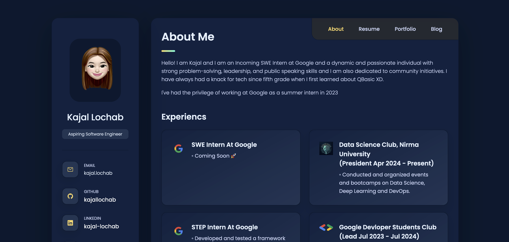
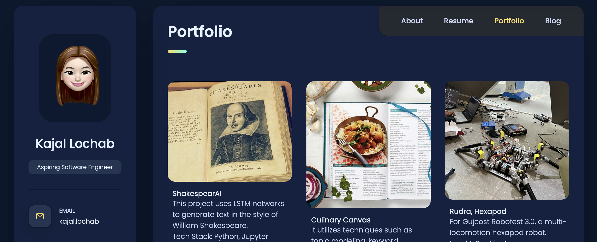
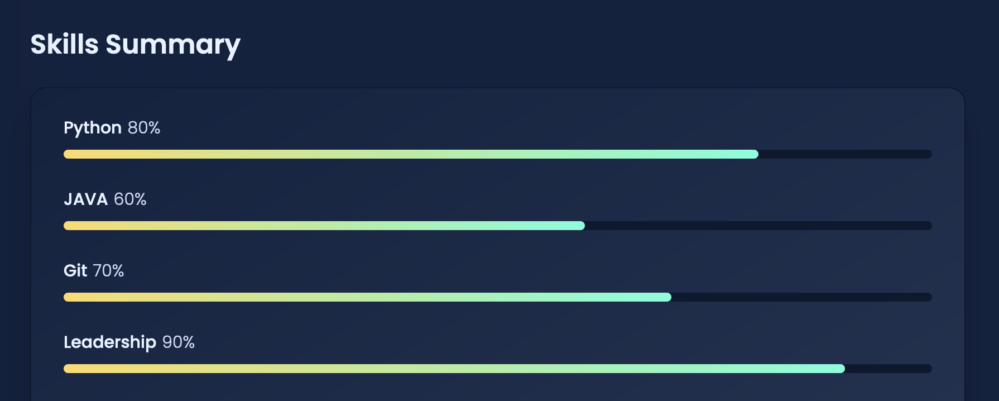
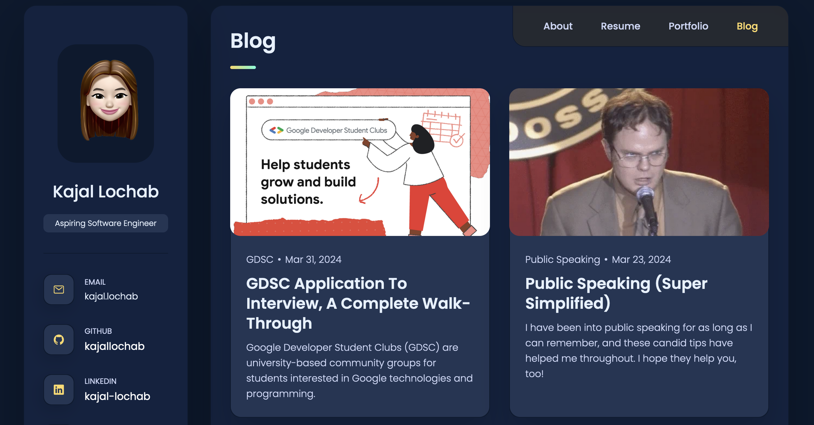

# Personal Portfolio

This repository contains the code for a personal portfolio website. It showcases the my resume, projects, blog posts, and contact information.

## Table of Contents

- [Description](#description)
- [Features](#features)
- [Screenshots](#screenshots)
- [Installation](#installation)
- [Usage](#usage)
- [Technologies](#technologies)
- [Contributing](#contributing)
- [License](#license)

## Description

This website serves as a digital portfolio to showcase my professional background, skills, projects, and blog posts. It provides visitors with an overview of the my accomplishments, experiences, and interests.

## Features

- Resume section with education and experience timelines.
- Portfolio section showcasing various projects with descriptions and links.
- Blog section displaying recent blog posts with summaries and publication dates.
- Contact section for reaching out to me.
- Responsive design for compatibility across different devices.

## Screenshots

## Installation

To run this website locally, follow these steps:

1. Clone this repository to your local machine.
2. Navigate to the project directory.
3. Open the `index.html` file in a web browser.

## Usage

After installation, you can browse through the different sections of the website to explore the my resume, projects, blog posts, and contact information. Click on the links provided to view more details or external resources.

## Technologies

The website is built using the following technologies:

- HTML5
- CSS3
- JavaScript
- Ionicons (for icons)

## Contributing

Contributions are welcome! If you find any issues or have suggestions for improvement, please feel free to open an issue or create a pull request. Make sure to follow the project's code of conduct.

## License

This project is licensed under the [MIT License](LICENSE).

